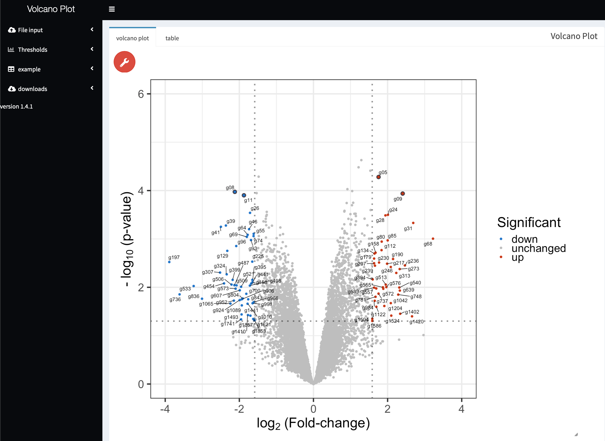

VolcanoPlot\_shiny\_app
=======================

This is an shiny app for generating and modifying volcano plots

R packages used and should be installed
=======================================

-   colourpicker
-   shinydashboard
-   DT
-   shiny
-   plotly
-   shinyWidgets
-   shinyjqui
-   formattable
-   tidyverse
-   metricsgraphics
-   RColorBrewer
-   scales
-   ggrepel

Screenshot of the app
=====================

Description & features
======================

With the app you can generate and customize a simple Volcanoplot and
download it as PDF.

**features:**

-   change cut-offs
-   customizeable colors
-   highlight with a custom ID table
-   …

Feel free to try the app.
